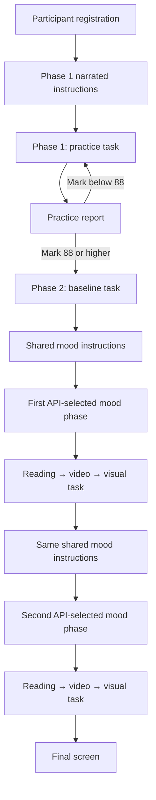

<div align="center">
  <p>
    
    &nbsp;&nbsp;&nbsp;
    
  </p>

  <h1>Rahmati Psychology Experiment</h1>

  <p>
    A Persian, right-to-left research application for studying working-memory-related
    performance and attentional orienting toward food cues through a timed visual-probe task.
  </p>

  <p>
    
    
    
    
  </p>
</div>

> [!IMPORTANT]
> This application supports a research protocol. It is not a clinical diagnostic tool, and the interpretation of scores and reaction times belongs to the study design and its research team.

## Contents

- [About the project](#about-the-project)
- [Experiment method](#experiment-method)
- [Four-phase participant flow](#four-phase-participant-flow)
- [Core features](#core-features)
- [Implementation methods](#implementation-methods)
- [Technology stack](#technology-stack)
- [Application routes](#application-routes)
- [Backend API contract](#backend-api-contract)
- [Getting started](#getting-started)
- [Project structure](#project-structure)
- [Quality checks](#quality-checks)
- [Operational and research notes](#operational-and-research-notes)

## About the project

Rahmati is the frontend for a four-phase psychology experiment. It presents rapid visual stimuli, follows the participant's spatial attention around food-related and comparison images, records left/right responses, and measures response time. The protocol combines:

- participant registration and session creation;
- narrated instructions;
- practice and baseline visual-probe trials;
- two API-selected mood phases;
- reading and video material for the mood phases;
- per-trial answer and reaction-time collection;
- a researcher-facing participant and report dashboard.

The current experimental task is implemented as a spatial visual-probe paradigm. Each trial is controlled by backend-provided timing, stimulus placement, target placement, and image metadata.

The entire participant interface is presented in Persian with right-to-left layout support.

## Experiment method

Every trial moves through three distinct substates:

```text
Fixation cross (+)
        ↓
Paired visual stimuli
        ↓
Left or right spatial target
        ↓
Keyboard response + reaction-time capture
        ↓
Immediate API submission
```

### 1. Fixation

A centered `+` keeps the participant's gaze in the middle of the screen. Its duration comes from `initial_duration` in the active API cluster.

### 2. Paired stimuli

Two images are displayed simultaneously. Food-related/special and comparison images are placed using backend metadata. Filler clusters are also supported. The display duration comes from `comparison_duration`.

### 3. Spatial target

After the images disappear, a yellow target appears on the left or right according to `target_position`.

### 4. Response and timing

The participant responds using the keyboard:

| Target position | Accepted input | Submitted value |
|---|---|---|
| Left | `D` or `ArrowLeft` | `LEFT` |
| Right | `K` or `ArrowRight` | `RIGHT` |

Timing begins when the target appears and uses `performance.now()` for high-resolution measurement. The rounded response time is submitted in milliseconds:

```json
{
  "cluster_id": "cluster-uuid",
  "answer": "LEFT",
  "response_time": 412
}
```

Repeated keydown events and duplicate in-flight submissions are ignored. If submission fails, retrying preserves the original answer and measured response time.

> [!NOTE]
> Backend duration values are passed directly to JavaScript timers and therefore need to be expressed in milliseconds. The current target state has no automatic timeout and waits for a valid participant response.

## Four-phase participant flow



| Phase | Purpose | Instructions | Media | Completion |
|---|---|---|---|---|
| **1 — Practice** (`تمرین`) | Teaches and validates the task | Unique narrated instructions | No video | Shows a report; `mark >= 88` unlocks baseline |
| **2 — Baseline** (`بیس لاین`) | Captures baseline performance | Intentionally skipped | No video | Continues to the first mood position |
| **3 — First mood position** | Runs whichever mood phase the API currently allows | Shared mood narration | Reading and video | Continues to the second mood position |
| **4 — Second mood position** | Runs the remaining mood phase | The same shared mood narration | Reading and video | Opens the final screen |

### API-controlled mood order

Phase 3 is **not hard-coded as positive**, and phase 4 is **not hard-coded as negative**. The backend may allow either order:

```text
Phase 3: خلق مثبت  →  Phase 4: خلق منفی
```

or:

```text
Phase 3: خلق منفی  →  Phase 4: خلق مثبت
```

For each mood position, the frontend selects exactly one phase where:

```js
is_allowed === true && is_passed === false
```

The active phase UUID, Persian name, `has_video`, and `video_seen` values come directly from `/probe/phases/`. Recognized phase-name and instruction metadata are cross-checked; contradictory mood metadata stops the flow instead of silently choosing the wrong content.

### Narrated instructions

- Phase 1 uses its own text and `first_ins.mp3`.
- Phases 3 and 4 share the same instruction text and `second_ins.mp3`.
- Phase 2 redirects directly to the trial and never displays instructions.
- Text reveal is calculated from audio `currentTime / duration` and weighted by line length.
- Pausing narration pauses both text progression and the active reveal animation.
- Resuming narration continues them from the same point.
- The start button remains disabled until narration finishes.

### Mood video flow

Mood phases present API-selected reading content followed by a server-provided video. The custom player supports play and pause without exposing seeking controls. The task begins only after:

1. the video reaches its `ended` event; and
2. video completion is successfully recorded by the API.

If `video_seen` is already true, a resumed session skips the completed reading/video sequence and returns to the task.

## Core features

### Participant experience

- Persian RTL registration for participant ID, age, gender, and group.
- Persian `مرد` / `زن` labels with exact API values `MALE` / `FEMALE`.
- Client-side validation and Persian API error mapping.
- Double-submit protection during registration and session preparation.
- Session-creation retry without registering the same participant again in the mounted form.
- Compact, single-viewport signup design for normal screen sizes.
- Dark glassmorphism UI, gradients, icons, responsive layouts, and motion effects.
- Global Persian toasts that can survive route navigation.

### Experiment execution

- Backend-controlled cluster count, timing, image placement, and target placement.
- Practice, baseline, filler, and mood-phase support.
- High-resolution reaction-time measurement.
- Route guards for phases that require instructions.
- Custom audio and video play/pause controls.
- Duplicate-load, duplicate-response, duplicate-completion, and stale-request safeguards.
- Recoverable error states for loading, answer submission, video loading, video completion, and phase transitions.

### Researcher results dashboard

- Participant table with total count, gender summaries, and average age.
- Search by participant ID, Persian gender label, or group.
- Persian and Arabic numeral normalization during search.
- Sorting, gender filters, responsive table scrolling, and compact mobile pagination.
- UTF-8 CSV export with Persian headers and spreadsheet-formula protection.
- Concurrent download of backend-generated Excel reports for every phase.
- Honest download states: complete, partial, failed, and no reports available.
- Direct navigation back to participant registration.

## Implementation methods

### Centralized phase state machine

Phase numbers, routes, instruction rules, completion behavior, and transitions are centralized in `src/utils/phaseFlow.js`. Components ask this module what happens next instead of independently duplicating navigation rules.

### Backend-authoritative session selection

`findValidSession()` validates the phase response, requires exactly one allowed and unfinished phase, creates a session using its API UUID, and persists the session metadata required by the next screen.

### Layered state management

- **Redux Toolkit** keeps authentication state available to React components.
- **Local storage** preserves the token, current phase ordinal, backend UUID, session ID, phase name, and video state across route changes and refreshes.
- **Component state and refs** manage fast trial substates, timers, request locks, retry data, and media elements without unnecessary global updates.

The final screen removes only experiment-related storage keys and resets Redux authentication state; it does not clear unrelated browser storage.

### Event-driven experiment states

The trial screen uses explicit states such as loading, reading, video, test, saving, finished, and recoverable error states. Inside the test, `INITIAL`, `COMPARISON`, and `TARGET` represent trial substates—not experiment phases.

### Resilient asynchronous behavior

The implementation includes:

- in-flight locks for registration, instructions, answers, media completion, reports, and phase transitions;
- stale request rejection and same-session load deduplication;
- response retry with the original measured time;
- phase-completion protection against duplicate calls;
- API-response shape validation and supported mood metadata validation;
- visible Persian recovery messages instead of exposing raw backend errors.

### RTL UI and accessibility considerations

- `lang="fa"`, RTL layouts, Ant Design `fa_IR`, and the Vazirmatn font.
- Persistent field labels and visible validation feedback.
- Persian accessible labels for controls and navigation.
- Decorative icons hidden from assistive technologies.
- Keyboard-focus styling and live download status announcements.
- Reduced-motion handling on key animated screens.

These are accessibility considerations, not a claim of full WCAG conformance.

## Technology stack

| Technology | Role in the project |
|---|---|
| **React 19** | Component-based participant, trial, and dashboard UI |
| **Vite 7** | Development server, HMR, and production bundling |
| **React Router 7** | Participant-flow and dashboard routing |
| **Redux Toolkit + React Redux** | Authentication state management |
| **Ant Design 5** | Forms, tables, buttons, feedback, themes, and Persian locale |
| **Ant Design Icons + Lucide React** | Interface and status iconography |
| **Tailwind CSS 4** | Responsive layout and utility styling |
| **Framer Motion** | Page entrances and interface animations |
| **Axios** | Registration, phase, session, response, video, and report requests |
| **React Toastify** | Persistent Persian loading, success, and error notifications |
| **Vazirmatn** | Persian interface typography |
| **ESLint** | Static code-quality checks |

## Application routes

| Route | Screen | Purpose |
|---|---|---|
| `/` | Signup | Participant registration and session initialization |
| `/instructions` | Instructions | Narrated guide for phases 1, 3, and 4 |
| `/Trial` | Trial | Reading, video, and visual-probe execution |
| `/Report` | Practice report | Practice result and the `88` pass gate |
| `/Final` | Final screen | Experiment completion and scoped state cleanup |
| `/results` | Results dashboard | Participant summaries and report downloads |
| `*` | Not found | Fallback for unknown routes |

> [!NOTE]
> Route paths currently preserve the mixed-case names used by the implementation. Hosting must provide SPA fallback to `index.html` so direct navigation to these routes works.

## Backend API contract

The backend is not included in this repository. The frontend currently expects the following endpoints:

| Method | Endpoint | Purpose |
|---|---|---|
| `POST` | `user/participant/register/` | Register a participant and return a token |
| `GET` | `probe/phases/` | Return phases and identify the active allowed phase |
| `POST` | `probe/sessions/create/` | Create a session using `phase_id` |
| `GET` | `probe/sessions/clusters/?session_id=...` | Load clusters, instruction metadata, and video data |
| `POST` | `probe/results/create/` | Save one cluster answer and response time |
| `POST` | `probe/videos/seen/` | Record completed video playback |
| `POST` | `probe/sessions/complete/` | Complete a session and return its mark when applicable |
| `GET` | `user/participants/` | Load participants for the results dashboard |
| `GET` | `user/participants/{subject_id}/` | Load one participant's phase-report metadata |

Probe requests after registration use token authentication:

```http
Authorization: token <participant-token>
```

The participant-detail endpoint returns report file URLs. Excel reports are generated by the backend and downloaded by the frontend; the frontend generates only the CSV participant export.

## Getting started

### Prerequisites

- Node.js 20 or newer
- npm
- A compatible backend service running locally or remotely

### 1. Install dependencies

```bash
npm ci
```

Use `npm install` instead when intentionally updating dependencies.

### 2. Configure the backend URL

The API base URL is currently defined in `src/utils/API_SERVER.js`:

```js
export const API_SERVER = () => {
  return 'http://127.0.0.1:8000/';
};
```

Change this value when the backend runs on another origin. Environment-based API configuration is not currently implemented.

### 3. Start development

```bash
npm run dev
```

Vite will print the local development URL, normally `http://localhost:5173/`.

### 4. Create a production build

```bash
npm run build
npm run preview
```

The optimized production files are written to `dist/`.

### Available scripts

| Command | Description |
|---|---|
| `npm run dev` | Start Vite with hot module replacement |
| `npm run build` | Build the production application |
| `npm run preview` | Serve the production build locally |
| `npm run lint` | Run ESLint across the project |

## Project structure

```text
src/
├── api/
│   └── probes.js              # Probe, session, video, and completion API helpers
├── assets/
│   ├── sounds/                # Narrated instruction audio
│   └── ...                    # Logos and visual assets
├── components/
│   └── ProgressiveForm .jsx   # Participant registration form
├── pages/
│   ├── SignUp.jsx             # Registration landing page
│   ├── InstructionsScreen.jsx # Synchronized narrated instructions
│   ├── Trial.jsx              # Reading, video, stimuli, timing, and answers
│   ├── Report.jsx             # Practice result and retry/pass decision
│   ├── FinalScreen.jsx        # Completion and experiment-state cleanup
│   ├── TableResults.jsx       # Researcher dashboard and exports
│   └── NotFound.jsx           # Unknown-route fallback
├── redux/
│   ├── authSlice.js           # Authentication actions and reducer
│   └── store.js               # Redux store
├── utils/
│   ├── API_SERVER.js          # API base URL
│   └── phaseFlow.js           # Routes, phase rules, and transitions
├── App.jsx                    # Global Persian toast host
├── main.jsx                   # React, Router, and Redux providers
└── routes.jsx                 # Route declarations
```

## Quality checks

Before committing a change, run:

```bash
npm run lint
npm run build
```

The repository currently has no automated unit, integration, or end-to-end test script. Adding tests for phase transitions, timing behavior, API failures, and route recovery is recommended.

## Operational and research notes

> [!WARNING]
> The `/results` route currently has no client-side authorization guard. Protect researcher data with appropriate backend authorization and a route-access strategy before production deployment.

- Participant tokens and experiment progress are stored in local storage for continuity. Review this choice against the study's threat model and privacy requirements.
- Deploy the frontend and backend over HTTPS.
- Establish informed-consent, retention, anonymization, and deletion procedures appropriate to the research protocol.
- Do not infer backend encryption or access-control guarantees from this frontend repository.
- Use environment-based API configuration for staging and production deployments.
- Configure the web server for SPA history fallback.
- Validate timing behavior on the exact browsers and hardware used during data collection.

---

<div align="center">
  <strong>Developed for a Persian psychology research workflow.</strong>
  <br />
  Kharazmi University · Iran National Science Foundation
</div>
